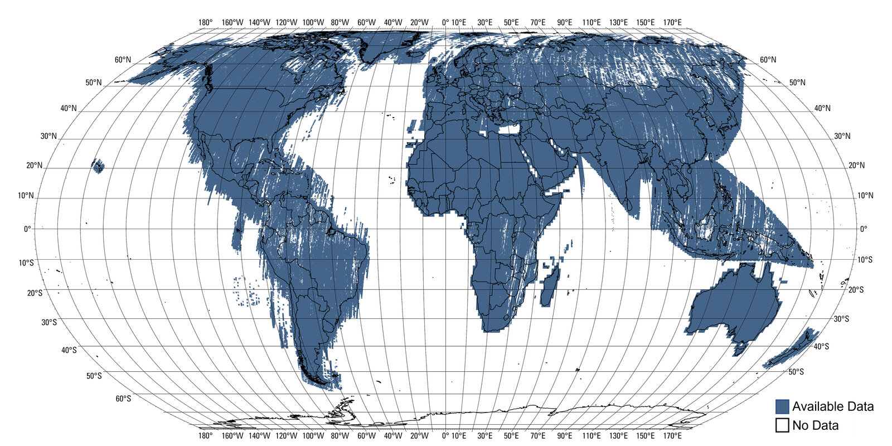

# Landsat land surface temperature

This repository turns Landsat Collection 2 Level-2 science products into a
high-temperature land surface temperature (LST) composite. Each pixel records
surface skin temperature at the satellite overpass time, not air temperature or
a daily maximum.

DERIVED from the current production constants, the composite uses Landsat 8 and
Landsat 9 acquisitions from 2021-01-01 through 2025-12-31T23:59:59Z. It covers
land between 60 S and 60 N.

The pipeline masks unusable observations before it calculates the ninety-fifth
percentile. The screen removes source fill, cloud, cloud shadow, snow, cirrus,
and temperatures outside the trusted input range.

Production runs also correct the visible steps at Landsat Worldwide Reference
System 2 (WRS-2) footprint boundaries. `lst-prep` estimates one offset per
scene against a monthly climatology. `lst-shard` then calculates one percentile
per WRS path and blends the results across swath edges. Where no fitted swath
covers a pixel, the pipeline uses the pooled percentile.

## Published product

Each production window becomes one
[Portolan](https://github.com/portolan-sdi/portolan-spec) STAC collection. The
collection contains one item per tile, and each item carries two Cloud-Optimized
GeoTIFFs (COGs).

DERIVED from the production grid, each tile spans 5 degrees in EPSG:4326 at
3,600 pixels per degree. A complete tile contains 18,000 by 18,000 pixels and
aligns exactly with its neighbours.

DERIVED from the writer contract, the published assets use this encoding:

| Asset | Contents | Encoding | Nodata |
|---|---|---|---|
| `lst_p95` | Corrected and blended 95th-percentile LST | `uint16`, one band, with `celsius = DN * 0.01 - 50.0` | DN `0` |
| `qa_count` | Valid observations by calendar month | `uint8`, 12 bands from January through December | none |

`qa_count` counts observations from scenes that pass the offset screen and
then pass the fill, QA, and trusted-range rules. DERIVED from the encoding, each
monthly count saturates at 255. Zero remains a real count, and this asset has no
nodata value.

The STAC item records the processing rules in `processing:lineage`. Read that
property before comparing tiles or releases because the rasters cannot identify
their own correction rule.

## Data access

MEASURED on 2026-09-15, the pending public catalog URL returned HTTP 404:

```text
https://data.source.coop/nlebovits/landsat-lst/catalog.json
```

The public paths will match the local catalog paths below.

A local run writes the relevant outputs under its output directory:

```text
composite-run/
├── summary.json
└── catalog/
    ├── catalog.json
    └── lst-p95-2021-2025/
        ├── collection.json
        ├── items.parquet
        └── S30W065/
            ├── S30W065.json
            ├── lst_p95.tif
            └── qa_count.tif
```

Read the scale and offset from the Cloud-Optimized GeoTIFF instead of copying
the constants into an app:

```python
import rasterio

path = (
    "composite-run/catalog/lst-p95-2021-2025/"
    "S30W065/lst_p95.tif"
)

with rasterio.open(path) as src:
    dn = src.read(1, masked=True)
    celsius = dn * src.scales[0] + src.offsets[0]
```

After publication, the same code can open an HTTPS asset URL. COG range
requests allow a client to read a window or overview without downloading a
whole tile. Use `items.parquet` when you need metadata for many tiles at once.

## Known product issues

### Nodata does not identify one cause

Several conditions cause the pipeline to write a nodata temperature:

| Condition | What happened |
|---|---|
| Missing input | No scene imaged the pixel, or no usable observation remained |
| Outside the product | The land geometry excluded the pixel, or the observations classified it as water |
| Too little evidence | The pixel did not meet the observation floor |
| Implausible result | The percentile fell outside the output temperature bounds |

Read the sum of the `qa_count` bands as evidence. A positive count beside
nodata points to the evidence floor or a temperature bound. A zero cannot
separate source fill, rejected observations, missing coverage, land masking, or
water masking.

Sharp rectangular gaps occur where scene bounding boxes extend beyond the
rotated Landsat image. `qa_count` cannot distinguish that source fill from a QA
rejection. The product has no source-presence band.

### ASTER emissivity gaps

Some pixels have no observations due to persistent cloud cover.

Landsat Collection 2 surface temperature also depends on mean emissivity from
the ASTER Global Emissivity Dataset (GED). ASTER GED uses clear-sky ASTER
observations collected from 2000 through 2008. [USGS documents persistent
Landsat temperature gaps where ASTER GED lacks mean
emissivity](https://www.usgs.gov/landsat-missions/landsat-collection-2-surface-temperature-data-gaps-due-missing-aster-ged).



*Blue shows available ASTER GED data; white shows gaps. This public-domain
[USGS map](https://www.usgs.gov/media/images/aster-ged-emissivity-coverage)
covers global land. The measurements below cover urban land only.*

An earlier analysis intersected ASTER GED observation counts with GHS-SMOD
R2023A urban land. MEASURED in that analysis, zero-observation cells cover
80,397 km2 of urban land. That equals 2.66% of the 3,027,063 km2 total.

MEASURED in the same analysis, another 10.23% of urban land rests on only one
or two ASTER observations. The zero-observation share varies sharply by region:

| Region | MEASURED share of urban land with no ASTER observations |
|---|---:|
| Southeast Asia | 12.07% |
| Amazonia | 11.62% |
| Southern Africa | 8.36% |
| Europe | 2.80% |
| North America | 1.18% |
| Australia | 0.30% |
| Sahara and Sahel | 0.00% |

These figures measure ASTER support over urban land, not missing pixels in this
product. UNKNOWN for current inputs: this repository has not rerun the global
urban analysis.

An ASTER zero-observation cell also does not locate every failed Landsat
retrieval. USGS interpolation leaves temperatures in much of the coarse gap
region. MEASURED on `S30W065`, 89.53% of processing-mask pixels inside those
cells still held a temperature.

MEASURED on the same tile, masking every zero-observation cell would remove
701,839 valid temperatures. Only 4,588 of those temperatures reached 70 C.
MEASURED across five tiles, the earlier paired gap-and-temperature rule also
missed the hot tail. All 207 pixels at or above 80 C on `N30E075` fell outside
the reported gap region and its one-cell buffer.

The current product reports the region instead of masking it. Each STAC item
stores its strict-land share as `lst:ged_gap_fraction`. DERIVED from the current
code, the pipeline applies the 80 C output maximum everywhere.

A larger reported fraction indicates greater coverage risk without predicting
an exact missing share. MEASURED on the 2026-09-14 run, three tiles showed this
relationship:

| Tile | MEASURED processing-mask pixels with no usable observation | MEASURED count outside the GED gap |
|---|---:|---:|
| `N40W080` | 289,580 | 0 |
| `S25E030` | 35,754,489 | 0 |
| `N00E110` | 105,608,892 | 5,895 |

Do not use `qa_count == 0` as an ASTER gap mask. A zero count cannot separate
ASTER failure from cloud, source fill, other QA rejection, or missing coverage.

### Seam correction changes the statistic

Corrected and pooled tiles measure different statistics. The correction shifts
each scene to a baseline fitted against its calendar month before calculating
the percentile.

Check `processing:lineage` before comparing tiles. UNKNOWN: agreement between
corrected neighbours because each tile receives an independent prep pass.

### Water screening favours retaining land

The buffered land geometry includes coastal water and misses rivers. The
pipeline also classifies water from the Landsat observations.

DERIVED from the current rule, water classification requires a 90% QA-flag
share and a percentile no warmer than 34 C. The temperature test avoids masking
dark roofs and asphalt but retains some warm water.

### Full-fleet operation remains unproven

UNKNOWN: fleet-scale reliability and cost. The repository records no complete
fleet run.

## Development and usage

DERIVED from the package metadata, development requires Python 3.12, 3.13, or
3.14 and [uv](https://docs.astral.sh/uv/). Install the package and its development
dependencies from the repository root:

```bash
uv sync
```

Run package commands through their console scripts. Do not invoke files under
`src/lst` by path.

### Rehearse locally

This small run uses synthetic scenes, skips the production output mask, and
writes a local catalog:

```bash
uv run lst-shard \
  --bbox=-65.0,-32.5,-64.5,-32.0 \
  --rehearse 6 \
  --pixels-per-degree 120 \
  --chunk 30 \
  --workers 2 \
  --threads-per-worker 1 \
  --no-output-mask \
  --out-dir ./rehearsal
```

The command prefixes output with `REHEARSAL:`, and `summary.json` records
`"synthetic": true`. A rehearsal proves only the execution path, not real-data
output, capacity, runtime, or cost.

### Prepare production inputs

A real tile needs the complete scene inventory, ASTER GED raster, and both land
geometries. The repository commits small test slices rather than the production
artifacts.

Build the land and inventory artifacts first:

```bash
uv run lst-land-tiles \
  --out artifacts/land_tiles.parquet \
  --write-geometry artifacts/land_buffered.gpkg \
  --write-strict-geometry artifacts/land_strict.gpkg

uv run lst-inventory \
  --land-tiles artifacts/land_tiles.parquet \
  --out artifacts/tile_scene_inventory.parquet
```

The ASTER GED build needs a NASA Earthdata login:

```bash
uv run python -c "import earthaccess; earthaccess.login(persist=True)"
uv run lst-aster-ged --out artifacts/aster_numobs.tif
uv run lst-fleet-plan --out artifacts/fleet_plan.json
```

### Run one real tile

Build the seam-correction artifact before the composite. Use the same tile,
window, inventory, and stage directory for both commands:

```bash
uv run lst-prep \
  --tile S30W065 \
  --stage-dir ./stage \
  --out-dir ./tile-prep

uv run lst-shard \
  --tile S30W065 \
  --tile-prep ./tile-prep \
  --engine fused \
  --stage-dir ./stage \
  --out-dir ./composite-run
```

A full tile requires production-scale memory, storage, and requester-pays S3
access. Run `lst-prep` and `lst-shard` with `--dry-run` before allocating that
capacity. The [fleet runbook](fleet/README.md) covers EC2 launch, monitoring,
teardown, and catalog promotion.

### Check changes

```bash
uv run ruff check .
uv run ty check --extra-search-path tests --extra-search-path fleet
uv run lint-imports --no-logo
uv run pytest
vale --minAlertLevel=error README.md FINDINGS.md docs/PROSE.md
```

The package keeps three layers separate. `lst.*` holds the run path,
`lst.fleet` holds deployment operations, and `lst.measure` holds one-off
measurements. Read `src/lst/__init__.py` before changing those boundaries.

## License

The code uses the [Apache License 2.0](LICENSE). The data uses `CC0-1.0`,
based on USGS terms for Landsat Collection 2 products.
